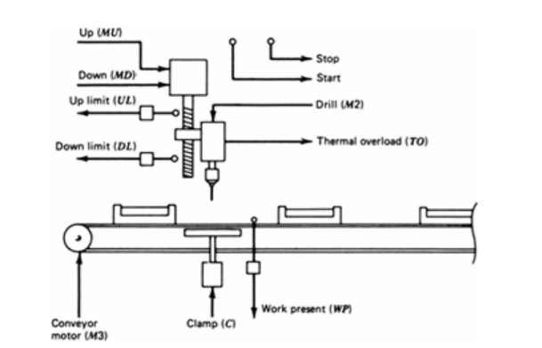

# Automated Drilling of Workpieces on Conveyor Belts

## 🛠 Project Overview

This project simulates an automated drilling station that performs drilling operations on workpieces transported by a conveyor belt. It demonstrates key elements of industrial automation including safety interlocks, actuator sequencing, and fault handling using PLC Ladder Logic and HMI.

---
📹 [Watch Demo](https://drive.google.com/file/d/1WxfzdE_2e0mCl525VYx_dJia_ioOth0S/view?usp=sharing)

## ⚙️ System Description

1. Move a workpiece into position  
2. Clamp it  
3. Start the drill motor  
4. Move the drill down to drill a hole (only if no thermal overload occurs)  
5. Back the drill out  
6. Turn the drill off  
7. Repeat the process for the next workpiece

- **Safety Interlocks**: The system halts if a thermal overload occurs and triggers a red indicator light.
- **Controls**: Includes master **Normally Open (NO) Start** and **Normally Closed (NC) Stop** pushbuttons.
- **Limit Switches**: Both NO and NC contacts are available.

> 📌 Ladder logic was developed to model this process precisely.

